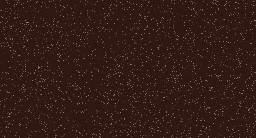
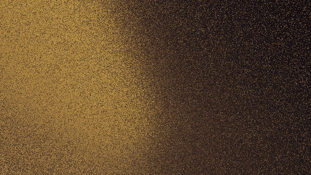

# My First Neural Network: Image Approximation with Gradient Descent

## Project Overview

This project showcases my initial foray into the fascinating world of neural networks. The core idea behind this project is to train a simple feedforward neural network to learn a mapping between 2D spatial coordinates (x, y) and their corresponding RGB color values. Essentially, the neural network "learns to create an image" by generating the color for each pixel given its position. It's a more fleshed out version of the "Hello world" of neural networks (the fruit classification problem). 

This project is a fundamental demonstration of how neural networks can approximate complex functions, and it highlights the power of **gradient descent** for optimization and **backpropagation** for efficient weight updates.

## How It Works

The neural network in this project takes two input values (x, y coordinates, typically normalized between 0 and 1) and outputs four values (R, G, B, A color components, also normalized between 0 and 1).

1.  **Input:** Each training sample consists of a pixel's (x, y) coordinate.
2.  **Target Output:** The corresponding (R, G, B, A) color value of that pixel in the target image.
3.  **Forward Pass:**
    * The input (x, y) passes through several layers of neurons, with each neuron applying a weighted sum of its inputs followed by an activation function (sigmoid, ReLU).
    * The final output layer produces the predicted (R, G, B, A) color for the given (x, y) coordinate.
4.  **Loss Calculation:**
    * A loss function (Mean Squared Error - MSE ) compares the predicted color with the actual target color. This quantifies how "wrong" the network's prediction is.
5.  **Backpropagation:**
    * This is the crucial step where the error is propagated backward through the network.
    * Using the chain rule of calculus, the gradients of the loss function with respect to each weight and bias in the network are calculated. These gradients indicate the direction and magnitude of change needed to reduce the loss.
6.  **Gradient Descent (Optimization):**
    * With the gradients in hand, **gradient descent** is used to update the weights and biases of the network.
    * Each weight and bias is adjusted slightly in the direction that decreases the loss, multiplied by a `learning_rate` to control the step size.
    * This iterative process of forward pass, loss calculation, backpropagation, and weight update continues for many "epochs" until the network's predictions are sufficiently close to the target image's colors.

## Features

* Implementation of a basic feedforward neural network from scratch (no external libraries used).
* Demonstration of **gradient descent** as the optimization algorithm.
* Clear illustration of the **backpropagation algorithm** for calculating gradients.
* Learns to generate simple or complex images by mapping pixel coordinates to colors.
* Visualizes the learning process as the image "develops" over epochs.

## Getting Started

### Prerequisites

* Unity 6.0 or higher

### Installation

1.  **Clone the repository:**
    ```bash
    git clone https://github.com/Howest-DAE-GD/gameplay-programming-research-TagniPtto.git
    ```
### Usage

1.  **Prepare your target image:**
    * Assign a small target image (e.g., `target_image.png`) in the `NeuralNetwork` object in the scene. The network will try to learn this image. Consider starting with simple shapes or gradients before complex images. There is an `TextureResizer` object that you could use the shrink down you target image to fasten the learning process

2.  **Run the training script:**
    * Hit the play button in the unity editor.
    * You may want to disable the learningrate calculation in the NN script and manually set the learn rate during the learningprocess for better results
4.  **Observe the output:**
    * The script should ouput when a its done with one cycle through of the image.
    * Optionally, it might save generated images at various stages of training, showing the network's progress.
    * Finally, it will generate the learned image.
<div align="center">

  <table>
    <tr>
      <td align="center">
        <br>
        <b>Target Image 0</b>
      </td>
      <td align="center">
        <br>
        <b>Training Output 0</b>
      </td>
    </tr>
    <tr>
      <td align="center">
        <br>
        <b>Target Image 1</b>
      </td>
      <td align="center">
        <br>
        <b>Training Output 1</b>
      </td>
    </tr>
  </table>

</div>


## References
### Youtube
- [3blue1brown-NeuralNetworks-series](https://www.youtube.com/watch?v=tIeHLnjs5U8&list=PLZHQObOWTQDNU6R1_67000Dx_ZCJB-3pi&index=4)

- [CodingTrain-NeuralNetworks-series](https://www.youtube.com/watch?v=XJ7HLz9VYz0&list=PLRqwX-V7Uu6aCibgK1PTWWu9by6XFdCfh)


- [Sebastian_Lague-NeuralNetworks-Vid](https://www.youtube.com/watch?v=hfMk-kjRv4c)


### Wikipedia

- [Convolutions](https://en.wikipedia.org/wiki/Convolution)
- [Gradient_Descent](https://en.wikipedia.org/wiki/Gradient_descent)
- [BackPropagation](https://en.wikipedia.org/wiki/Backpropagation)

### Other websites
- https://medium.com/@senanahmedli89/building-neural-networks-manually-from-scratch-a-beginners-hello-world-efaf6acb8f76

